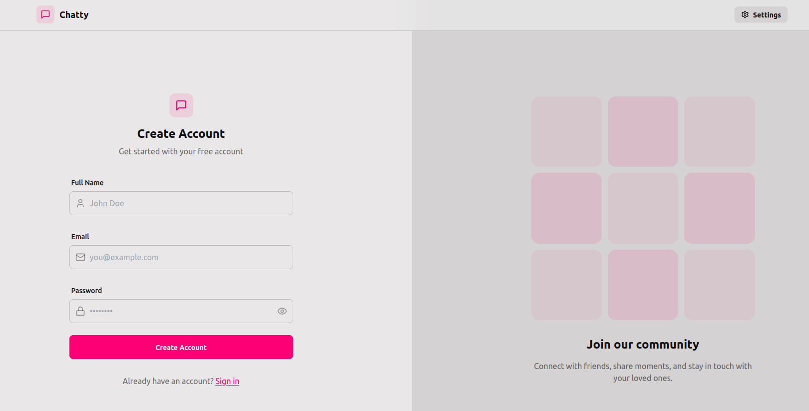
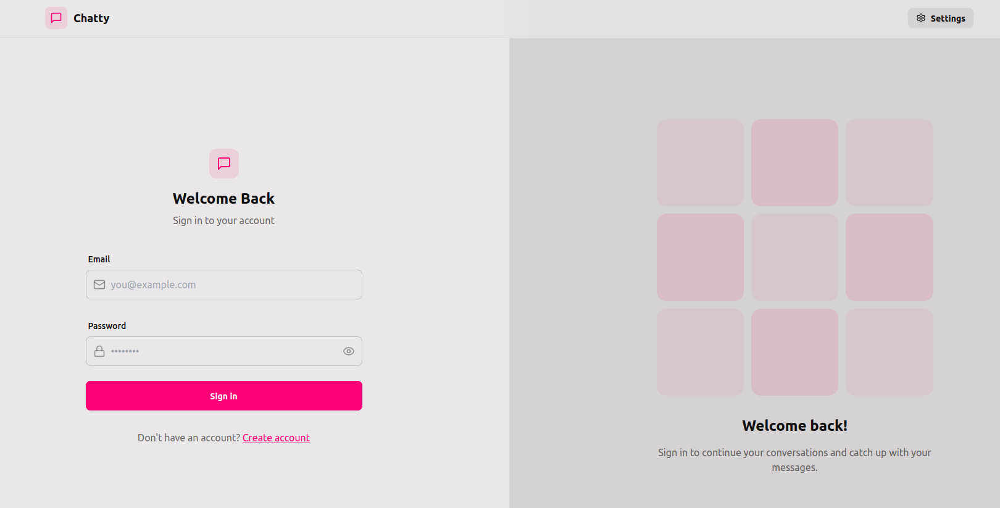
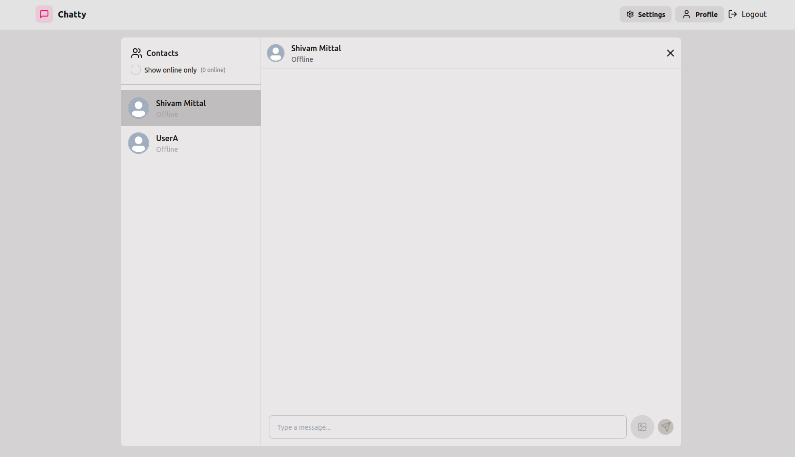
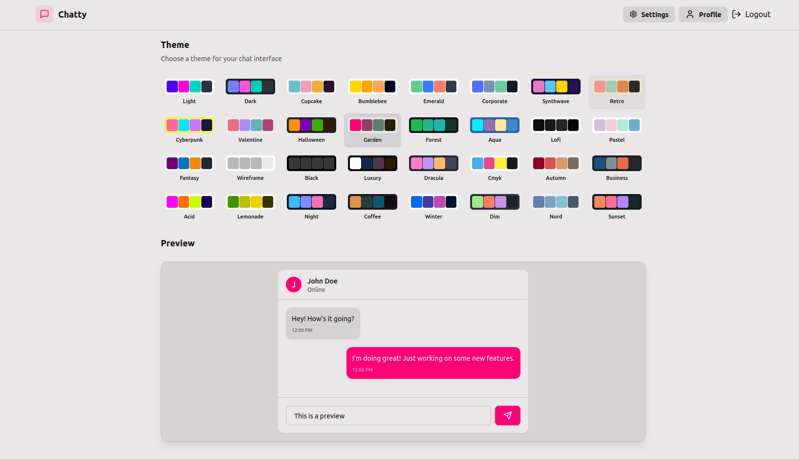
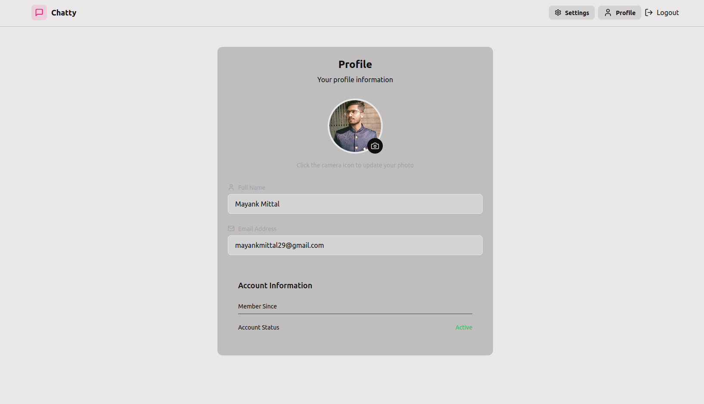

# ✨ Chatterly ✨

> 💬 A modern, feature-rich real-time chat application built with the MERN stack

## 🌈 Features

- 🔒 Secure user authentication & authorization with JWT
- 💬 Real-time messaging with Socket.io
- 👤 User profiles with customizable avatars
- 🟢 Live online status indicators
- 🎨 32 beautiful themes powered by DaisyUI
- 📱 Fully responsive design for all devices
- 🖼️ Image sharing in conversations
- 🔔 Elegant notifications with react-hot-toast
- 🛡️ Enhanced security with HTTP-only cookies

## 🛠️ Tech Stack

- **Frontend:**
  - ⚛️ React.js
  - 🎭 Zustand for state management
  - 🎨 TailwindCSS + DaisyUI for styling
  - 🔌 Socket.io-client for real-time communication
  - 🚨 React Hot Toast for notifications
  - 🎯 Lucide React for beautiful icons
  
- **Backend:**
  - 🟢 Node.js & Express.js
  - 🍃 MongoDB for database
  - 🔌 Socket.io for real-time functionality
  - 🔑 JWT for authentication
  - ☁️ Cloudinary for image storage

## 📂 Directory Structure

```
chatterly/
├── frontend/                # React frontend
│   ├── public/              # Public assets
│   ├── src/
│   │   ├── components/      # UI components
│   │   ├── context/         # React context providers
│   │   ├── hooks/           # Custom hooks
│   │   ├── pages/           # Page components
│   │   ├── store/           # Zustand store
│   │   ├── utils/           # Utility functions
│   │   └── App.jsx          # Main app component
│   ├── index.html
│   └── package.json
│
├── backend/                 # Node.js backend
│   ├── controllers/         # Request handlers
│   ├── db/                  # Database connection
│   ├── middleware/          # Express middleware
│   ├── models/              # MongoDB models
│   ├── routes/              # API routes
│   ├── socket/              # Socket.io logic
│   ├── utils/               # Utility functions
│   ├── server.js            # Entry point
│   └── package.json
│
└── README.md                # Project documentation
```

## 🚀 Getting Started

### Prerequisites

- Node.js (v16+ recommended)
- MongoDB database
- Cloudinary account

### ⚙️ Environment Setup

1. Clone the repository
   ```bash
   git clone https://github.com/yourusername/chatterly.git
   cd chatterly
   ```

2. Set up backend environment variables
   Create a `.env` file in the `backend` directory:
   ```
   MONGODB_URI=your_mongodb_connection_string
   PORT=5001
   JWT_SECRET=your_secret_key
   
   CLOUDINARY_CLOUD_NAME=your_cloud_name
   CLOUDINARY_API_KEY=your_api_key
   CLOUDINARY_API_SECRET=your_api_secret
   
   NODE_ENV=development
   ```

3. Install backend dependencies
   ```bash
   cd backend
   npm install
   ```

4. Install frontend dependencies
   ```bash
   cd ../frontend
   npm install
   ```

### 🏃‍♂️ Running the Application

#### Development Mode

1. Start the backend server
   ```bash
   cd backend
   npm run dev
   ```
   Backend will run on http://localhost:5001

2. Start the frontend development server
   ```bash
   cd frontend
   npm run dev
   ```
   Frontend will run on http://localhost:5173

#### Production Mode

1. Build the frontend
   ```bash
   cd frontend
   npm run build
   ```

2. Start the backend server (which will serve the frontend build)
   ```bash
   cd backend
   npm start
   ```

## 🧪 API Testing

All API endpoints have been thoroughly tested using Thunder Client.

### 📝 API Endpoints

- **Authentication**
  - `POST /api/auth/signup` - Register new user
  - `POST /api/auth/login` - Login user
  - `POST /api/auth/logout` - Logout user
  
- **Users**
  - `GET /api/users` - Get all users for Sidebar on Home Page
  
- **Messages**
  - `GET /api/messages/:id` - Get messages of specific id user
  - `POST /api/messages/send/:id` - Send a message to user of id

## 🔐 Security Features

- JWT stored in HTTP-only cookies to prevent XSS attacks
- Token expiration set to 7 days
- CSRF protection implemented
- Password hashing with bcrypt
- Input validation and sanitization
- Secure HTTP headers

## 🎨 Theme Customization

Chatterly comes with 32 beautiful themes powered by DaisyUI. Users can change themes in the settings panel:

1. Click on your profile icon in the navbar
2. Select "Settings"
3. Choose from available themes
4. Watch as the entire app transforms instantly!

## 📱 Screen Captures
### Signup Page

### Login Page


### Chat Interface


### Theme Selection


### Profile Display

## 🚀 Deployment

Chatterly can be deployed for FREE using the following services:

1. **Backend & Frontend:**
   - [Render](https://render.com/) - Free tier for web services
   - [Railway](https://railway.app/) - Free tier with limited usage

2. **Database:**
   - [MongoDB Atlas](https://www.mongodb.com/atlas/database) - Free tier for small projects

3. **Image Storage:**
   - [Cloudinary](https://cloudinary.com/) - Free tier with generous limits

Follow their respective documentation for deployment instructions.

## 🤝 Contributing

Contributions are welcome! Please feel free to submit a Pull Request.

1. Fork the project
2. Create your feature branch (`git checkout -b feature/amazing-feature`)
3. Commit your changes (`git commit -m 'Add some amazing feature'`)
4. Push to the branch (`git push origin feature/amazing-feature`)
5. Open a Pull Request


## 🙏 Acknowledgements

- Socket.io for making real-time communication easy
- TailwindCSS & DaisyUI for beautiful UI components
- The MERN stack community for excellent documentation
- All open-source contributors whose libraries made this project possible

---

Made with ❤️ by [Mayank Mittal ](https://github.com/mayankmittal29)
